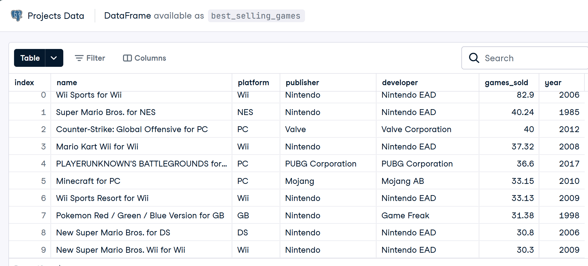
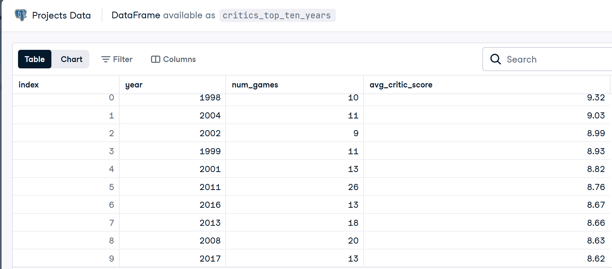
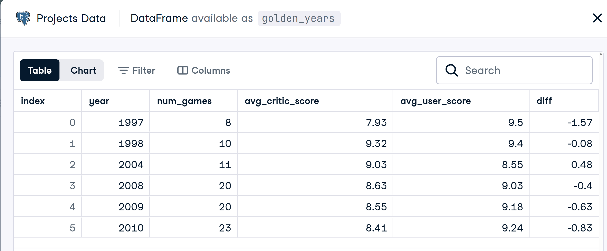
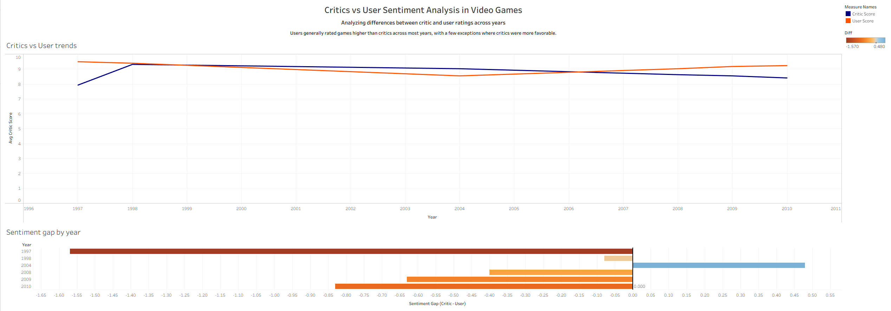

# 🎮 Video Game Sentiment Analysis

Analyzed video game sales and review data using SQL to uncover differences between critic and user sentiment. Built aggregated datasets and a custom metric to quantify rating gaps, revealing trends in how audiences and critics evaluate games over time.

## 🧠 Key Insights
- Identified years where critics and users strongly disagreed on game quality  
- Created a custom **sentiment gap (diff)** metric to measure differences  
- Used SQL joins and aggregations to analyze multi-source datasets  

## 🛠️ Tools Used
- SQL (PostgreSQL)
- Tableau Desktop

## 📊 Results

### Best Selling Games

  

### Critics Top Ten Years

  

### Golden Years (Critic vs User Comparison)

  

## 📊 Tableau Dashboard

  

