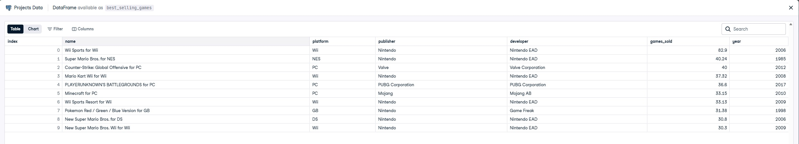
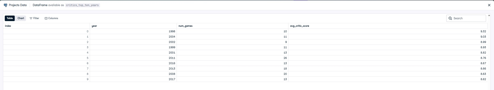
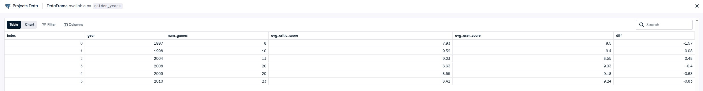

# video-game-sentiment-analysis
Analyzed video game sales and review data using SQL to uncover differences between critic and user sentiment. Built aggregated datasets and a custom metric to quantify rating gaps, revealing trends in how audiences and critics evaluate games over time.

## Results

### Best selling games

### Critics Top Ten Years

### Golden Years

